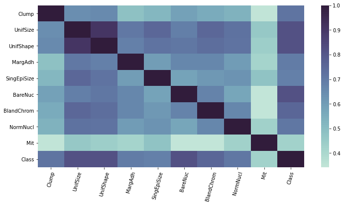
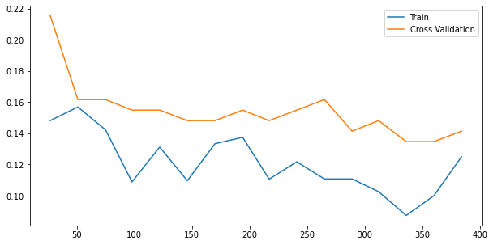
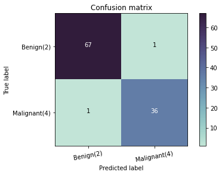
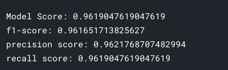
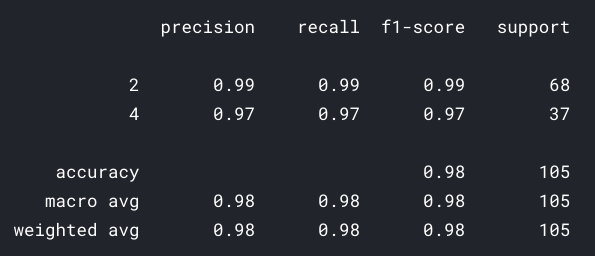

# classify-benign-or-malignant

Here [Breast Cancer](https://www.kaggle.com/karteek93/breast-cancer) by [karteek menda](https://www.kaggle.com/karteek93) is used to create a `machine learning` model to classify `Breast Cancer`. `EDA` is also done on this dataset.

## Table of contents

- [Getting started](#getting-started)
- [EDA and Model performance](#eda-and-model-performance)
- [License](#license)

## Getting started

The [notebook](https://www.kaggle.com/akashsdas/classify-benign-or-malignant) is available on Kaggle to work in the same environment where this notebook was created i.e. use the same version packages used, etc...

## EDA and Model performance

## License

[APACHE LICENSE, VERSION 2.0](./LICENSE)
